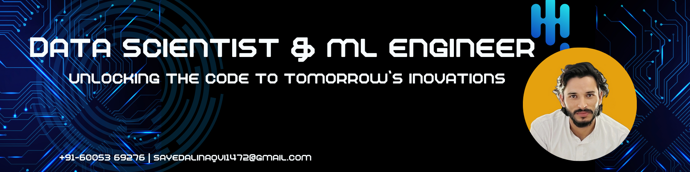

<h1 align="center">Hi 👋, I'm Sayed Zaheer Abass</h1>

<h3 align="center"><b>Machine Learning & Full-Stack Web Developer | AI Enthusiast</b></h3>

  

* 🎓 Master's in **Artificial Intelligence & Machine Learning**, *Jamia Millia Islamia (2024–2026)* — CGPA: **9.25**
* 🧠 Passionate about **Machine Learning**, **Computer Vision**, and **Data Science**
* 🌱 Currently building ML apps using **Streamlit**, **TensorFlow**, **PyTorch**, and **Scikit-Learn**
* 🌐 Proficient in full-stack web development with **MERN Stack**
* 📫 Reach me at **[sayedalinaqvi1472@gmail.com](mailto:sayedalinaqvi1472@gmail.com)**

---

## 🌐 Socials

---

## 💻 Tech Stack

### Machine Learning & Data Science

### Web Development & Version Control

### Databases

---

## 🧠 Other Skills

* Prompt Engineering
* AI Model Evaluation
* Data Mining & Visualization
* Time Series Analysis
* Statistical Analysis & Modeling
* Problem Solving & Critical Thinking
* Team Collaboration & Communication

---

## 📜 Certifications

* [CS50x: Introduction to Computer Science – Harvard](https://cs50.harvard.edu/certificates/d4f29502-f9b6-4354-9255-686ee75d252a)
* [CS50SQL: Databases with SQL – Harvard](https://cs50.harvard.edu/certificates/e4b06cec-c697-456a-97a0-1139d180bc5a)

---

## 📊 GitHub Stats

 
 

---

## 🏆 GitHub Trophies

---

## 🔝 Top Contributed Repo

---

## ✍️ Developer Quote

---

<h2 align="center">Thank You 😊</h2>
